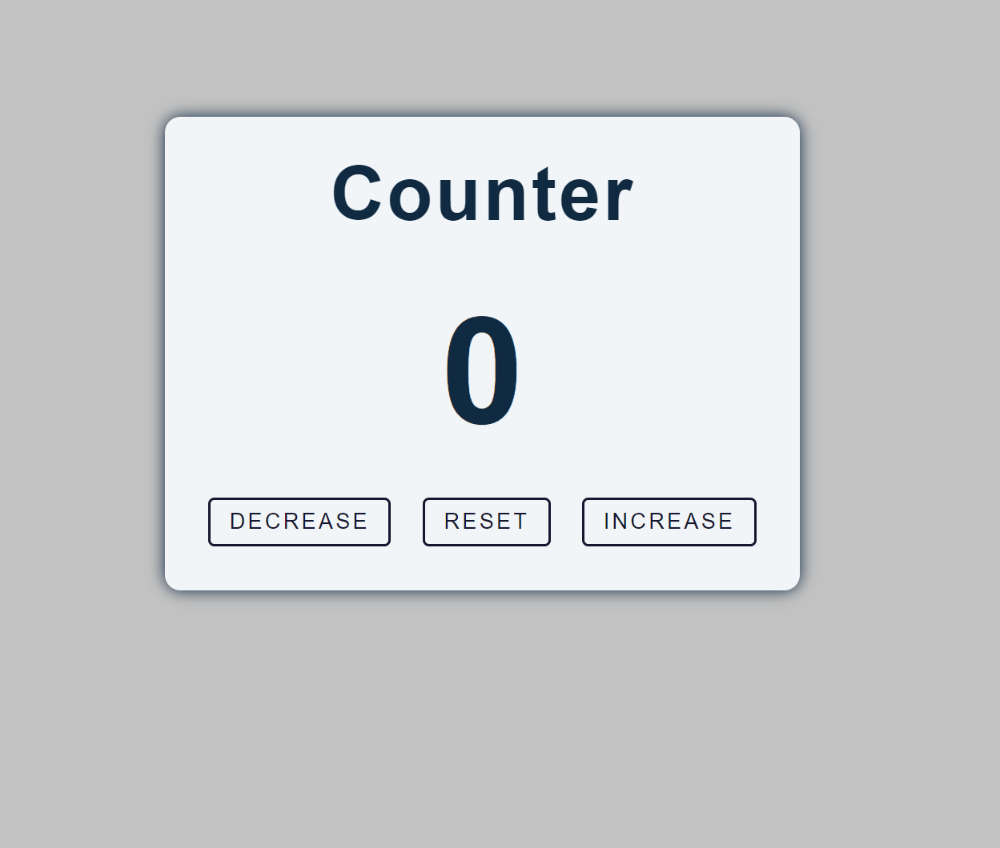

# Counter App

A simple counter application made with HTML, CSS, and JavaScript. This app allows users to increase, decrease, and reset a counter value displayed on the screen.

## Demo

Check out the live demo of the project [here](https://sanskargupta0.github.io/Counter/).


## Features

- **Increment Counter**: Increase the displayed count by 1 with each click.
- **Decrement Counter**: Decrease the displayed count by 1 with each click.
- **Reset Counter**: Reset the counter to zero.

## Preview



## Technologies Used

- **HTML**: Provides the structure for the counter display and buttons.
- **CSS**: Styles the appearance of the buttons and the counter display.
- **JavaScript**: Adds the interactive functionality for incrementing, decrementing, and resetting the counter.

## Installation

1. Clone the repository to your local machine:

   ```bash
   git clone https://github.com/YourUsername/Counter.git

2. Navigate to the project folder:

   ```bash
   cd Counter-App

3.Open index.html in your browser to use the counter.

